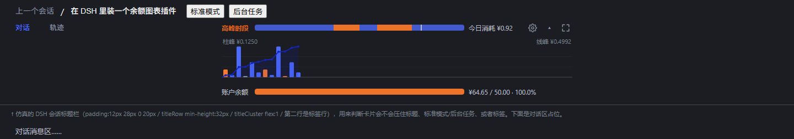
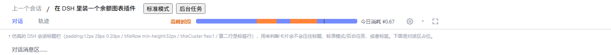
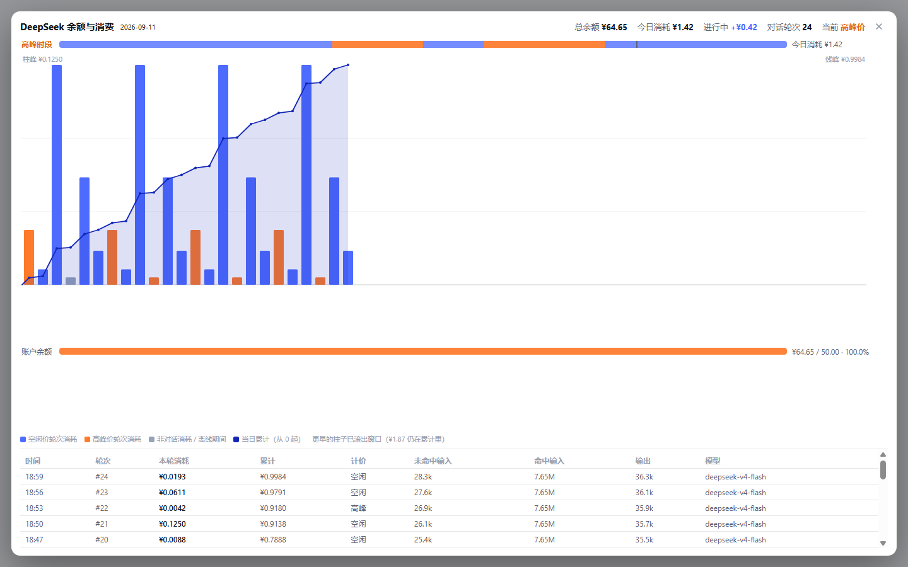
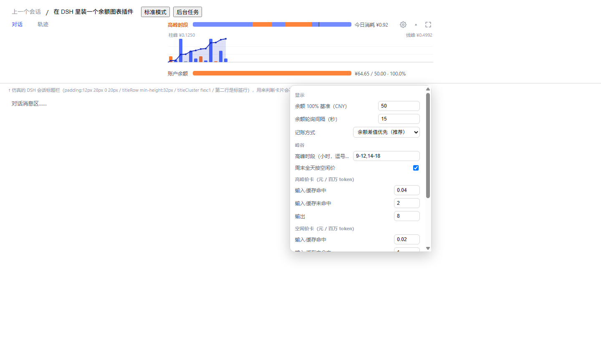
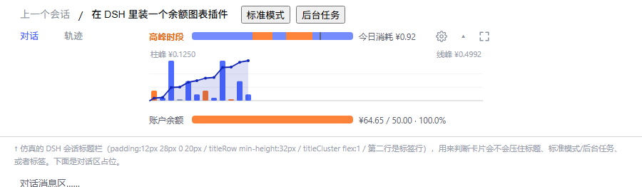
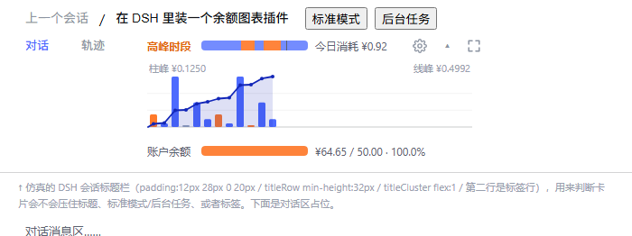

<div align="center">

# dsh-balance-chart

**把 DeepSeek 的余额和「今天花了多少」画在 DSH 的会话标题栏里。**

一个 [DSH (DeepSeek Harness)](https://www.npmjs.com/package/@deepseek-ai/dsh) Web GUI 插件：余额、当日消费、峰谷时段计价，
合成一张没有边框、直接画在标题栏上的双层图表。装一次，之后每轮对话花了多少钱都自己记好。

[](./LICENSE)
[](https://www.npmjs.com/package/@deepseek-ai/dsh)
[](https://nodejs.org/)
[](#技术实现)
[](#测试)
[](#安装)

[English summary](#english-summary) · [快速开始](#快速开始) · [安装教程](docs/INSTALL.md) · [配置](#配置点-⚙-打开设置) · [常见问题](#常见问题) · [安全与隐私](#安全与隐私)

</div>


<p align="center"><sub>↑ 真实渲染截图。上半：峰谷时段条 + 每轮消耗柱状图 + 当日累计折线；下半：账户余额进度条。<br>卡片没有边框和底色，直接画在「对话 / 轨迹」那一行上，标题行（面包屑、标准模式、后台任务）完全不受影响。</sub></p>

---

## 这个插件解决什么问题

用 DeepSeek 的时候，真正难回答的是这几个问题：

- **现在余额还剩多少？** —— 官方平台要开新页面、重新登录才看得到。
- **今天已经烧了多少钱？** —— 平台以「天」为单位给总数，不告诉你钱是花在哪一轮对话上的。
- **上一轮对话到底花了多少？** —— 长上下文 / 长输出那一轮可能几毛钱，短问答可能几厘钱，事后完全对不上号。
- **现在是高峰价还是空闲价？** —— DeepSeek 的错峰计价是按小时的，写代码写到一半根本不会去算现在是几点、是不是翻倍时段。

这个插件把四个答案放在你**一眼就在看的地方**：会话标题栏正中。不用切窗口，不用刷新页面，不用记任何命令。

## 效果

| 浅色主题（宽窗口） | 深色主题 |
|---|---|
|  |  |

| 悬停任意一列看细节 | 折叠成一行摘要 |
|---|---|
|  |  |

| 全屏视图（图表 + 每轮明细表 + 图例） | ⚙ 设置面板 |
|---|---|
|  |  |

窗口窄一点也不怕，卡片按 `min(640px, 54vw)` 缩，700px 宽仍可用：

<p>


</p>

## 功能一览

<table>
<tr><td width="160"><b>余额进度条</b></td><td>横向条显示账户余额；满格金额（默认 ¥50）在设置里可改。和峰谷条共用同一套轨道几何与配色，两条条的左右边缘必然对齐。</td></tr>
<tr><td><b>峰谷时段条</b></td><td>24 小时时段带，工作日 <code>9:00-12:00</code>、<code>14:00-18:00</code> 为高峰（橙），其余含周末为空闲（蓝）；一条灰色细线标出当前时刻。整条<b>可点击</b>，新标签页打开 DeepSeek 平台用量页。</td></tr>
<tr><td><b>每轮消耗柱状图</b></td><td>每根柱子 = 一次对话（一轮 turn）的余额消耗，按当时的计价时段着色。灰色柱 = 非对话消耗或离线期间的账。</td></tr>
<tr><td><b>当日累计折线</b></td><td>叠加在柱状图上的折线，从 0 记起，回答「今天累计花了多少」。折线最右端永远等于「今日消耗」。</td></tr>
<tr><td><b>悬停详情</b></td><td>鼠标停在任意一列：该列高亮 + 虚线导引 + 折线上对应点放大 + 其他柱子变淡，并弹出提示面板（时间 / 本轮 / 累计；全屏里还有余额差值、换算值、tokens 拆分、模型名）。提示面板自动翻边，不会出画布。</td></tr>
<tr><td><b>⛶ 全屏视图</b></td><td>放大图表 + 每轮明细表（时间 / 轮次 / 本轮消耗 / 累计 / 计价 / 未命中输入 / 命中输入 / 输出 / 模型）+ 图例。<kbd>Esc</kbd> 或点背景关闭。</td></tr>
<tr><td><b>▴ 折叠</b></td><td>折叠成 26px 摘要条（正好是「对话 / 轨迹」那行文字的高度），只留余额和今日消耗。状态会记住，重启浏览器依然折叠。</td></tr>
<tr><td><b>⚙ 设置</b></td><td>余额基准、轮询间隔、记账方式、峰谷时段、价卡、周末规则，全在界面里改，不碰代码。写在 <code>$DSH_HOME/.dsh-balance-chart.json</code>，重启后仍是你的设置。</td></tr>
<tr><td><b>自动贴到最新</b></td><td>柱子放不下时横向滚动，并且卡片和全屏都会自动滚到最新那一根，不会永远停在今天最早那几根上。</td></tr>
</table>

**刻意不做的事**：没有动画形象、没有音效、没有随机台词、没有宠物养成——只有余额、当日消费和峰谷。如果你想要一只会拖拽吸附、数字滚动的小鲸鱼娘，那请用 [MeteorNOX/DeepSeek-Balance-Whale-Widget](https://github.com/MeteorNOX/DeepSeek-Balance-Whale-Widget)；两个插件做的事不冲突，也可以一起装。

## 快速开始

四步，五分钟。**更细的分步图文（含 macOS / Linux）见 [`docs/INSTALL.md`](docs/INSTALL.md)。**

```powershell
# 0) 前置：Node.js ≥ 20，且 DSH 已经能正常跑起来（dsh web 能打开页面）

# 1) 把这个仓库克隆到一个「不会被随手删掉」的目录
git clone https://github.com/fqsklm/dsh-balance-chart.git
cd dsh-balance-chart

# 2) 装进 web profile（包本体留在原地，profile 里建一个链接指向它）
dsh plugin --profile web add link:$PWD
```

3）**把插件挂到配置树里**：编辑 `$DSH_HOME/profiles/web/cordis.patch.yml`（默认就是 `~/.dsh/profiles/web/cordis.patch.yml`），
在文件末尾加上这一段：

```yaml
- insert:
    - id: balance-chart
      name: dsh-balance-chart
```

4）**回浏览器按 F5。** 会话标题栏正中就会出现图表卡片。

```powershell
# 想确认装成功了：
curl.exe -s http://127.0.0.1:3080/dsh-balance/state      # 应当返回一段 JSON（余额 + 当日序列 + 配置）
```

> **为什么要手动加第 3 步？** 这是**故意**的：web profile 是 `patchReload: live`，只有 profile 自己的 patch 文件被监听，
> 所以把它写在这里就能做到**改完立刻生效、不用重启 `dsh web`**。本包自带的 `cordis.patch.yml` 因此留空（`[]`）；
> 如果两边都写 `insert`，配置树里会出现两行同 id 的 loader 行，两个实例会抢同样的 HTTP 路由并报错。

### 一行版（给已经熟悉的人）

```powershell
git clone https://github.com/fqsklm/dsh-balance-chart.git; cd dsh-balance-chart
dsh plugin --profile web add link:$PWD
Add-Content "$env:USERPROFILE\.dsh\profiles\web\cordis.patch.yml" "`n- insert:`n    - id: balance-chart`n      name: dsh-balance-chart"
# 然后 F5
```

**前置条件**：DSH 的凭据里已经有 `DEEPSEEK_API_KEY`（和 `llm-deepseek` 用的是同一个）。
没有它，余额那一层会显示「余额不可用」，但每轮消耗的换算值仍然照常工作。

**更新到新版本**：

```powershell
cd dsh-balance-chart
git pull
# 只改了 lib/client.js → 回浏览器 F5 即可
# 改了 lib/index.js   → 重启 dsh web，再 F5
```

**卸载**：先删掉 `cordis.patch.yml` 里那段 `insert`，再 `dsh plugin --profile web remove dsh-balance-chart`。
（数据文件 `$DSH_HOME/.dsh-balance-chart.json` 想留就留、想删就删。）

## 怎么用

- **看一眼**：卡片展开时，第一行是峰谷条和「今日消耗 ¥x」，下面是柱状图 + 折线，最下面是余额条。
- **看某轮的细节**：把鼠标移到那一根柱子上。
- **去平台看账**：点峰谷条任意位置，新标签页打开 <https://platform.deepseek.com/usage>。
- **不想让它占地方**：点 `▴` 折叠成一行；状态会记住。
- **想看全天的账**：点 `⛶` 打开全屏，右下是每轮明细表；<kbd>Esc</kbd> 关闭。
- **金额都对不上**：点 `⚙` 改价卡（DeepSeek 调价后自己改，不用改代码）。

## 配置（⚙ 打开设置）

| 项 | 默认值 | 说明 |
|---|---|---|
| 余额 100% 基准 | `50`（元） | 横向余额条满格对应的金额。**余额右边显示的 `/ 50.00 · 100.0%` 用的就是这个数**，不是写死的 100。 |
| 余额轮询间隔 | `15`（秒） | 拉取 `api.deepseek.com/user/balance` 的间隔，范围 5–600 秒。间隔越短，记账越准，请求越多。 |
| 记账方式 | `余额差值优先` | `余额差值优先`：用相邻两次余额观测的下降额记账，最贴近真实扣费（推荐）。<br>`仅按价卡换算`：完全按 token 用量 × 价卡换算，不看余额。 |
| 高峰时段 | `9-12,14-18` | 小时区间，逗号分隔。格式支持 `9-12`、`9~12`、`9到12`；起止为 0–24 的整数，必须后大于前。 |
| 周末全天按空闲价 | 勾选 | DeepSeek 官方规则：周末全天按空闲价。 |
| 高峰价卡 | 见下 | 元 / 百万 token。 |
| 空闲价卡 | 见下 | 元 / 百万 token。 |
| 按钮 | — | 保存 / 立即刷新余额 / 清空当日记录 / 恢复默认。 |

价卡默认值（元 / 百万 token，官方 2026-09-10 12:00 起执行）：

| 时段 | 输入·缓存命中 | 输入·缓存未命中 | 输出 |
|---|---|---|---|
| 高峰（工作日 9-12、14-18） | 0.04 | 2 | 8 |
| 空闲（其余时间，含周末） | 0.02 | 1 | 4 |

> 未命中价同时用于 `cacheWrite` token。**DeepSeek 调价后请在设置里改，不用改代码。**
> 「上层图表占比」这个选项在早期版本里存在，现在已经**删掉**：竖向图与余额条的高度比锁死在 65%，旧配置文件里带着别的值也不生效——免得界面上的承诺和实际渲染对不上。

配置文件：`$DSH_HOME/.dsh-balance-chart.json`（`DSH_HOME` 默认 `~/.dsh`）。
想手改也行，格式就是插件自己写的 JSON；改完点一下「立即刷新余额」或重载页面即可读回。

## 它是怎么算钱的

**双轨制，余额差值优先：**

1. **余额差值（权威）** —— 每 15 秒（以及每轮对话结束后 2.5s / 8s / 16s 补采）拉一次
   `https://api.deepseek.com/user/balance`。相邻两次观测里余额的**下降额**就是真实扣费。
   充值导致余额上升时不记为消费（单独记一笔）。
2. **价卡换算（回退）** —— 监听 DSH 会话事件，按 `turn/start` → `assistant/chunk(usage)` /
   `assistant/message(usage)` → `turn/end` 汇总**精确 token 用量**，再用峰谷价卡换算成金额。
   当余额差值拿不到时（比如本轮只花了 ¥0.003，而余额接口只给两位小数）用它兜底。

### 一笔扣费归到哪一轮

观测到余额下降时，按这个顺序归属：

1. **有正在进行的对话** → 记到它头上（先躺在 `pending` 里，这一轮 `turn/end` 时才并入柱子）。
   长对话会横跨好几次轮询，不这么做的话这些钱会落到「上一轮」或变成灰色「其他消耗」，
   于是本轮柱子偏小、图上多出莫名其妙的灰柱。
2. **没有进行中的对话，但最近 10 分钟内刚结束过一轮** → 记到它头上
   （扣费入账有延迟，`turn/end` 之后的那几次补采就属于这种情况）。
3. **都不满足** → 建一个灰色「其他消耗」桶（换了别的客户端，或插件加载之前的历史扣费）。

另外，如果上一次观测到现在的这段差值**跨了自然日**（典型场景：昨晚关掉 `dsh web`，今早再打开，
中间用量平台、别的客户端或夜间任务花了钱），这笔钱**照样记进今天**——「今日消耗 ¥x」要回答的是
「今天总共花了多少」，而不是「这个网页开着的时候花了多少」。只是它的**具体时刻不可知**，
所以会单独标成 `offline`：在图上是一根灰色柱子，悬停提示写「离线期间」，并且绝不会被并进正在进行的这一轮。

标题栏那颗数字就是 **今日消耗 = 已结算 + 进行中**，悬停会写明两项各是多少、以及「这份记录从 HH:MM 起」。
柱子 / 折线只画**已结算**的轮次，所以图上最后那根柱子会比这个总数小一点，差额就是正在进行的那一轮。

柱子数量有上限（`maxTurns`，默认 200）。**超过上限时更早的柱子会滚出窗口，但那部分金额不会被忘掉**：
它累进一个单独的 `trimmed` 计数，「今日消耗 ¥x」与折线最右端始终等于当天的真实总额，
全屏视图的图例里会提示滚出了多少。

## 常见问题

<details>
<summary><b>标题栏里什么都没有 / 卡片没出现</b></summary>

按顺序查：

1. `cordis.patch.yml` 里那段 `insert` 加了吗？`id` 必须是 `balance-chart`，`name` 必须是 `dsh-balance-chart`。
2. `dsh plugin --profile web add link:<路径>` 执行成功了吗？（可以在 `~/.dsh/profiles/web/package.json` 里看到这个依赖。）
3. **按 F5**。客户端 bundle 要重新拉一次才会挂上插槽——这是最常见的「其实装好了但看不见」。
4. 还是不行就看 `dsh web` 的日志里有没有 `balance-chart:` 开头的报错。典型报错是「重复路由」——说明 loader 行插了两遍。
</details>

<details>
<summary><b>显示「余额不可用」</b></summary>

说明 Balance 接口没拿到数据。依次检查：

- DSH 凭据里有没有 `DEEPSEEK_API_KEY`（和 `llm-deepseek` 用的是同一个）。
- 网络能不能直连 `api.deepseek.com`（有些网络环境下需要代理）。
- 点设置里的「立即刷新余额」，看 `curl http://127.0.0.1:3080/dsh-balance/state` 返回的 `balance.error` 字段——里面有具体原因（未配置 KEY / HTTP 状态码 / 超时）。

注意：**余额不可用时，每轮消耗的换算值仍然照常工作**，柱状图不会因此空掉。
</details>

<details>
<summary><b>金额和平台对不上 / 比平台少一点</b></summary>

几种正常情况，先对照一下再怀疑插件：

- **正在进行的那一轮还没结算**：标题栏的「今日消耗」含进行中，但柱子和折线只画已结算的轮次，所以最右那根柱子会小一点。
- **插件加载之前发生的消耗不会补记**：当日消费从插件开始运行那一刻起算（余额差值法是「向前观测」的，装之前的历史用量没有基准可以还原）。
- **跨天那一笔的日期只能近似**：昨晚 23:00 之后的消耗会被记到今天这一格里，因为插件在关机期间看不到余额。
- **余额接口只给两位小数**：单轮几分钱以下的消耗靠价卡换算补齐，所以小数位可能有细微差异。
- **平台调价了**：去设置里改价卡。
</details>

<details>
<summary><b>柱子底部被滚动条裁掉 / 出现一条很粗的原生滚动条</b></summary>

这是 Windows 上的一个真实 bug，已经修好。原因值得记一下：**在 Chrome 里，只要给滚动条写了 `scrollbar-width`，
`::-webkit-scrollbar` 的自定义样式就会被整块忽略、退回系统原生滚动条**（Windows 实测 10px、带两枚箭头按钮），
比容器预留的高度多 3px，正好把柱子底部裁掉。插件的做法是只写
`::-webkit-scrollbar{height:var(--dsh-scrollbar-width,8px)}`，跟着宿主主题走，
**绝不写 `scrollbar-width`**（Firefox 没有 `::-webkit-scrollbar`，那条规则包在 `@supports not selector(::-webkit-scrollbar)` 里）。
如果你在自己改样式时踩到同样的坑，量一下 `--dsh-scrollbar-width` 再决定预留多少，别写死数字。
</details>

<details>
<summary><b>改了代码，怎么生效？</b></summary>

| 改了哪半 | 生效方式 |
|---|---|
| `lib/client.js`（界面） | **自动**。`dsh-client-hmr` 每 500ms 轮询客户端 bundle，变了就广播新 rev；按 F5 拿到新字节。 |
| `lib/index.js`（宿主） | **必须重启 `dsh web`**。 |
| `package.json` 的 `dsh.client` 声明 | 重启 `dsh web`（profile 的 `patchReload: live` 只监听 patch 文件，不监听 bundles 列表）。 |

宿主这半为什么绕不过去——**五种免重启方案全部实测失败**，别再浪费时间试：

| 尝试 | 结果 |
|---|---|
| ① 摘掉 loader 行再挂回（同一 id、同一 `name`） | 不重新 import |
| ② 同一 id 只改 `name` 加 `?v=N` | 不重新 import |
| ③ 新 id + **相对路径** specifier | 相对路径运行期解析不了，整个 patch 应用**回滚**，旧树静默保留（接口 200、模块图还在，看起来像成功，其实什么都没发生） |
| ④ `exports["."]` 指向**新文件** + 摘掉再挂回 | 仍不重新 import——模块缓存是按 **specifier** 建键的，不是按解析出来的 URL |
| ⑤ **子路径** specifier（`dsh-balance-chart/host`） | 行直接加载失败（404），**并且客户端半侧从模块图里消失**——包名解析器不接受含 `/` 的 specifier |

另外两个血的教训：

- **别在运行期删掉 loader 行解析到的那个文件。** 删过 `lib/index.js`，后果是那一行的卸载/摘除**静默失败**
  （接口一直 200，看起来正常），直到把文件放回去才恢复。
- 判断「新代码是否真的生效」不能只看接口 200 或模块图还在，要**看新版本独有的字段/行为**
  （比如靠 `pending` / `trimmed` 这两个字段存在与否来判断）。
</details>

## 安全与隐私

- **只用 `DEEPSEEK_API_KEY` 做一件事**：以 `Authorization: Bearer <key>` 调用 `https://api.deepseek.com/user/balance`。
  key 由 DSH 的凭据服务按请求解析，插件不落盘、不回传、不出现在任何响应里。
- **数据只写在本机** `$DSH_HOME/.dsh-balance-chart.json`，不发送给任何第三方。仓库里不含任何密钥。
- **插件注册的三个路由没有鉴权**：`/dsh-balance/state`、`/dsh-balance/config`、`/dsh-balance/refresh`。
  它们挂在 DSH 自己的 `webServer` 上，**可访问范围 = 你 `dsh web` 的监听范围**。
  如果你把 `dsh web` 绑到了 `0.0.0.0` 并暴露到公网，那么同网络的人也能读到你的余额和用量曲线，
  还能改配置（改不了 key）。**建议绑定 `127.0.0.1`** 或放在反向代理的鉴权后面。
- 这三个接口只读余额 / 用量 / 配置，**没有**任何读取环境变量或文件系统内容的入口。

## 技术实现

零第三方依赖，宿主侧只 import `node:` 内置模块。

```
                     ┌─────────────────────── 浏览器（lib/client.js） ───────────────────────┐
                     │  conversation.session.header.utilities → ChartCard（卡片，z-index 10）  │
                     │  shell.overlay                        → FullscreenView（全屏，z-index 60）│
                     └───────▲───────────────────────────┬────────────────────────────────────┘
              GET state / POST config / POST refresh      │ 每 4s 轮询 state
                     ┌───────┴───────────────────────────▼────────────────────────────────────┐
  宿主（lib/index.js）│ 余额采样（每 15s + 轮末 2.5/8/16s 补采） ｜ session/event → turn 汇总  │
                     │ 记账：余额差值优先，价卡换算兜底         ｜ 落盘 $DSH_HOME/.dsh-balance-chart.json │
                     └───────────────────────┬──────────────────────────────────────────────┘
                                             ▼
                              api.deepseek.com/user/balance（凭据由 DSH 注入）
```

**三个本地接口**

| 方法 | 路径 | 用途 |
|---|---|---|
| GET | `/dsh-balance/state` | 余额 + 当日序列（柱子/累计）+ 配置 + 当前峰谷与运行状态 |
| GET / POST | `/dsh-balance/config` | 读配置 / 写配置（JSON patch；`__clear` 清空当日记录，`__reset` 恢复默认） |
| POST | `/dsh-balance/refresh` | 立即刷一次余额 |

**挂载位置与几何（想改样式的人先读这段）**

- 卡片用**一个 0 尺寸的占位块**当锚点留在标题行的插槽里，卡片本身绝对定位，
  `left:50% + translateX(-50%)` 水平居中，再用 `margin-top:17.5px` 从「标题行垂直中心」下移到「标签行文字的中心」。
  这样标题行始终是它自己的 32px，面包屑和右侧的「标准模式 / 后台任务」都不会被挤或被盖。
- 卡片尺寸 `min(640px, 54vw)`、展开 152px、折叠 26px；展开态由一条 `:has()` 规则让标签行留高
  （顺便 `align-items:flex-start`，否则 flex 会把标签按钮拉满高度、按钮内部又把文字居中，把「对话 / 轨迹」推到中间去）。
- **卡片层级必须落在 `8 < z < 20`。** 上限来自宿主 `shell.overlay` 那一层（`z-index:20`）：卡片必须低于它，否则全屏盖不住卡片；
  下限来自宿主的吸顶元素——代码块表头 `z-index:6`（就是「复制」那一行，会盖住设置窗口）、输入区 / 聊天槽 `z-index:7`、
  宽度拖柄 `z-index:8`。当前用 **10**。
- 上下两行的列宽只在 `ROW_*` 一组常量里定义一次（CSS 与组件共用）：
  `[标签 52][gap 8][轨道 flex:1][gap 8][数值 96][gap 6][按钮 84]`，
  所以「改了一处、另一处对不上」不可能发生；上下两行右侧总宽相同，两条轨道必然对齐。
  全屏那一行没有按钮、而金额更长（含 `/ 100% 基准`），所以用更宽的数值列 `ROW_VALUE_W_FULL = 150`。
- 配色只用 **DeepSeek 特征蓝 `#4d6bfe`** 和配套的高饱和橙 `#ff7a2a`（空闲蓝 / 高峰橙，正好对应平台的峰谷计价），
  灰色 `#94a3b8` 只留给「非对话消耗」。折线（当日累计）是另一个量纲，用同一支蓝再深一档 `#1226b8`
  （深色主题下换成 `#9db0ff`）区分，不和空闲柱子撞色。
- 深色主题只切一条折线颜色，判定方式是 `document.body.hasAttribute('data-ds-dark-theme')`；
  其余颜色全部走宿主 `--dsw-*` 变量并带浅色回退。

## 测试

不需要任何测试框架，全部是 `node` 直接可跑的脚本，宿主侧用假的 `ctx` / `fetch` / 会话事件，
客户端侧用极简 React/DOM 替身真跑一遍 bundle。

```powershell
node test/host-smoke.mjs       # 宿主侧：假 ctx/fetch/会话事件跑完整记账流程（39 项）
node test/client-smoke.mjs     # 客户端：极简 React/DOM 替身里真跑一遍 bundle、渲染、点交互（61 项）
node test/live-verify.mjs      # 线上：问运行中的 dsh web 要模块图 + 抓 bundle 比对（38 项）
node test/render-preview.mjs --probe   # 真实浏览器布局量测（631 项断言，16 个变体）
node test/render-preview.mjs           # 只生成 preview/*.html，不跑浏览器
node test/render-preview.mjs --shots   # 顺便截图到 preview/shots/
node test/overflow-probe.mjs   # 滚动条诊断：哪一格有滚动条 / 谁在横向溢出（可带 @宽x高）
node test/appcss-preview.mjs   # 把真实 app 的全局 CSS 注进预览页再量（排查「预览正常、真机不对」）
```

`render-preview.mjs` 把客户端 bundle 真正跑一遍、展开成 DOM、序列化成独立 HTML，再交给 **headless Chrome**
打开，用页面内的量测脚本把真实几何写进 DOM，用 `--dump-dom` 回读并断言。它回答的是前几套测试回答不了的问题：
卡片真的是 640×152、真的居中（偏移 < 1px）吗？窄到 700px 面包屑还在吗？滚动条出现时上层容器有没有正好让出
**实测**滚动条高度（而不是写死的 7px）？悬停提示会不会出画布？设置菜单会不会被宿主的吸顶代码块表头盖住（用
`document.elementFromPoint` 做**命中测试**，不是看样式）？

生成的 `preview/*.html` 是**可以直接用浏览器打开看**的独立页面（里面带一份仿真 DSH 表头），
所以不用装插件也能先看效果。

> ⚠️ `--probe` / `--shots` 需要放宽沙箱：受限模式禁止程序使用命名管道，Chrome 的 Mojo IPC 会以
> 「拒绝访问 (0x5)」直接崩掉。
> ⚠️ 别给量测加 `--hide-scrollbars`：那样滚动条高度永远量成 0，「容器给滚动条让位够不够」这一整类断言就永远通过——
> 「预留 7px、真机滚动条 10px、柱子底部被裁掉 3px」这个 bug 就是这么藏了很久的。

## 项目结构

```
dsh-balance-chart/
├── lib/index.js            # 宿主侧：余额采样、turn 记账、三个本地 HTTP 接口
├── lib/client.js           # 浏览器侧：卡片 / 全屏视图 / 设置面板（手写 React 组件，无构建步骤）
├── cordis.patch.yml        # 故意留空，激活行放在 profile 的 patch 层（原因见「快速开始」）
├── test/                   # 8 个 node 直接可跑的测试 / 量测脚本
├── preview/                # 生成的独立预览页、布局量测报告、截屏
├── docs/
│   ├── INSTALL.md          # 分步安装教程（Windows / macOS / Linux）+ 排错
│   └── images/             # README 用图
└── package.json
```

**环境变量**：`DSH_HOME` 决定配置与数据文件的位置（默认 `~/.dsh`）。
日志里所有本插件输出都以 `balance-chart:` 开头，方便过滤。

## 已知取舍

- **插件加载之前发生的消耗不会补记。** 当日消费从插件开始运行那一刻起算；余额差值法是「向前观测」的，
  装之前的历史用量没有基准可以还原。（`dsh web` 关着的那段时间不一样：那段时间的余额下降会在下次打开时按「离线期间」补记进当天。）
- **跨天那一笔的日期只能按「观测到的时刻」近似。** 昨晚 23:00 之后的消耗会被记到今天这一格里，
  因为插件在关机期间看不到余额，无法把午夜前后切开。
- 余额接口只给两位小数，单轮几分钱以下的消耗靠价卡换算补齐。
- 图表用的是余额差值，所以「当日消费」反映的是**实际扣费**，不是「按现价重算的理论值」。
- 目前只做 **CNY**（`config.currency` 默认 `CNY`，余额接口返回多币种时按它挑选）。

## English summary

**dsh-balance-chart** is a zero-dependency plugin for the [DeepSeek Harness (DSH)](https://www.npmjs.com/package/@deepseek-ai/dsh) web GUI.
It renders a borderless, glass-free chart card centered on the conversation header's second row — the line holding the
「对话 / 轨迹」 tabs — showing your **DeepSeek account balance**, **today's spend per conversation turn**, and the
**peak / off-peak pricing window** you're currently in.

- **Two-layer chart**: per-turn spend bars (colored by peak/off-peak) with a cumulative-spend line, plus a horizontal balance bar.
- **Accurate accounting**: balance-delta first (poll `api.deepseek.com/user/balance`, attribute each drop to the turn that caused it),
  falling back to token-usage × price-card estimation. The ledger lives in `$DSH_HOME/.dsh-balance-chart.json` and never leaves your machine.
- **Interactions**: hover any bar for details, click the 24-hour peak band to open the platform usage page, `⛶` for a full-screen view
  with a per-turn table, `▴` to collapse to a one-line summary, `⚙` to edit the price card and thresholds. Light and dark themes supported.
- **No animation gimmicks**: no mascot, no sounds, no random lines. Just the numbers.

**Install (quick)**: `git clone https://github.com/fqsklm/dsh-balance-chart.git` → `dsh plugin --profile web add link:$PWD` →
append the `insert` loader row to `$DSH_HOME/profiles/web/cordis.patch.yml` → press F5.
Full walkthrough, including macOS/Linux and troubleshooting, is in [`docs/INSTALL.md`](docs/INSTALL.md) (Chinese).

Licensed under the [MIT License](./LICENSE). Issues and PRs are welcome.

## 致谢 / 参考

- [MeteorNOX/DeepSeek-Balance-Whale-Widget](https://github.com/MeteorNOX/DeepSeek-Balance-Whale-Widget) ——
  这个项目的文档结构和「把余额放进 DSH 界面」的思路给了很大参考；如果你想要一只可拖拽吸附的余额小鲸鱼娘，去看它。
- DeepSeek 官方峰谷计价规则与价卡（`2026-09-10 12:00` 起执行）—— 本插件的默认价卡就来自它。

## License

[MIT](./LICENSE) © 2026 fqsklm
